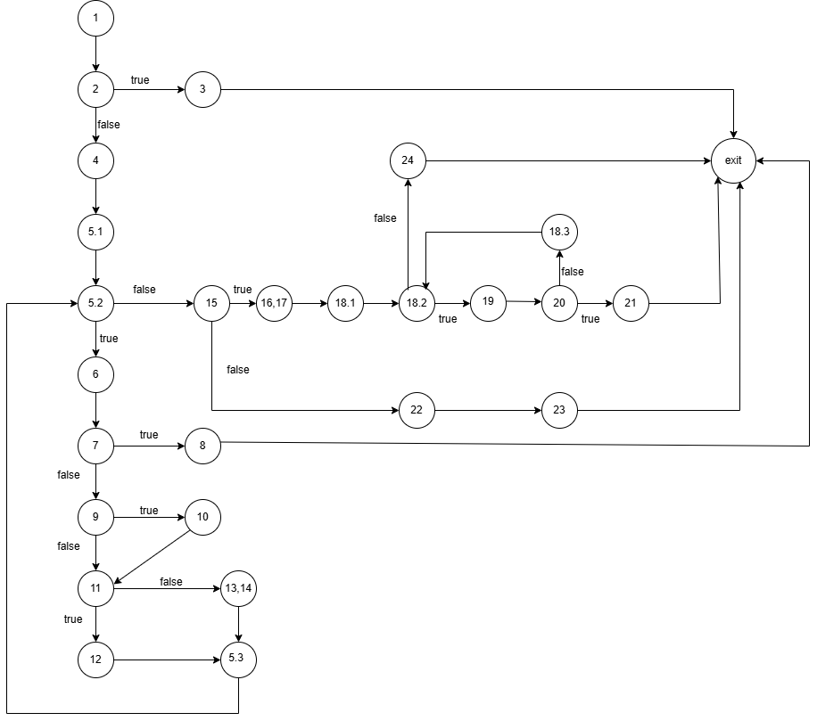

**Втора лабораториска вежба по Софтверско инженерство**
---
**Симона Мицева 233174**
---

**Control Flow Graph**
---

**Цикломатска комплексност**
---
Цикломатската комплексност на кодот изнесува 9.Овој резултат го добив од бројот на региони плус надворешната област.

**Тест случаи според Every Statement критериумот**
